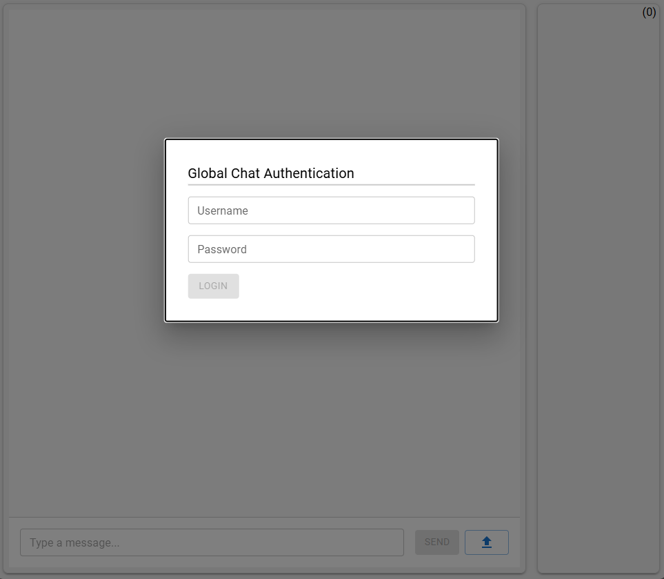
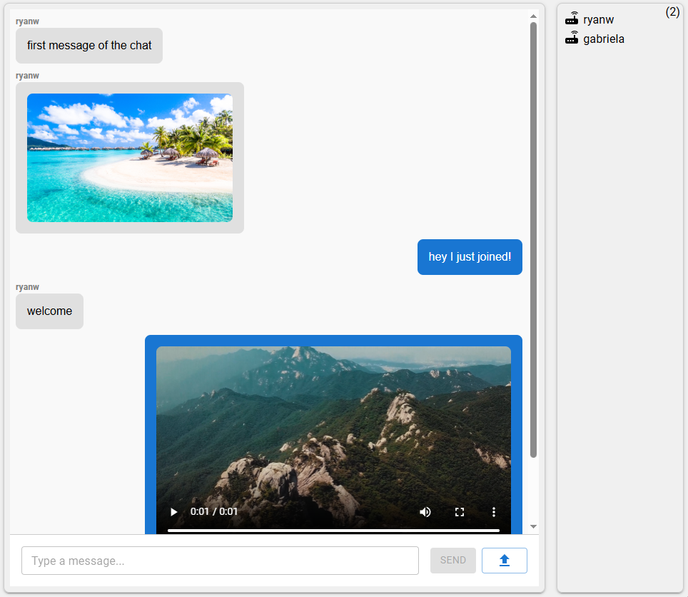
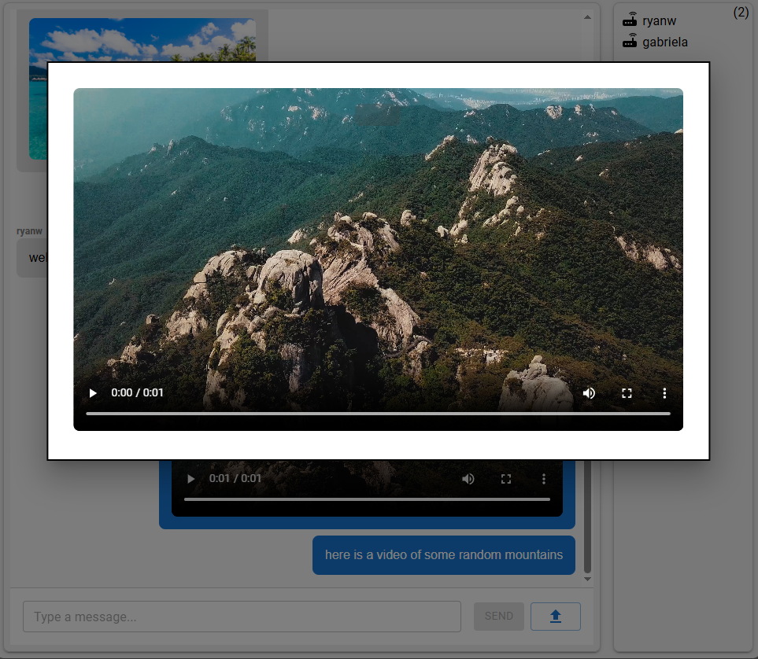
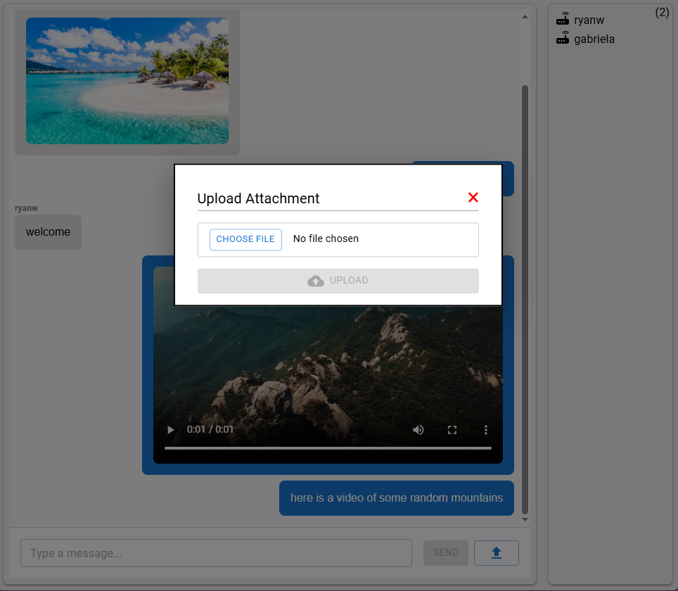

# Global Chat Application
Global Chat allows users to authenticate with their own accounts, view currently online users, and communicate in real time.
It utilizes WebSockets for instantaneous, asynchronous messaging, with all messages and media stored and managed through a database-backed system.

 

# Requirements
- NPM
- Node.js
- Nginx web server
- PostgreSQL (used as the primary database for storing accounts, messages, and media)
- Read & write permissions enabled for the server directory  
  `sudo chmod -R 777 /var/www/html/`

# Server Setup
- Navigate to `/server/`
- Install dependencies: `npm install`
- Start the server: `node server.js`

# Client Setup
- Install dependencies: `npm install`
- Configure environment variables to match your deployment